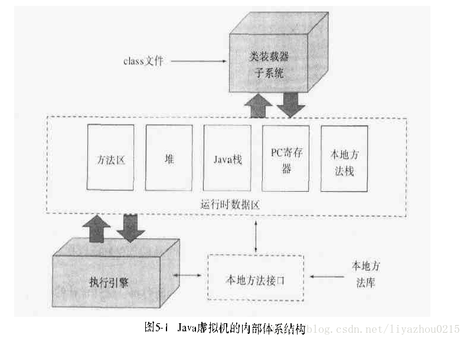

### Java virtual machine，jvm体系结构
#### jvm实现过程：
JVM屏蔽了与具体平台相关的信息，使Java语言编译程序只需要生成在JVM上运行的目标字节码（.class），就可以在多种平台上不加修改地运行。Java 虚拟机在执行字节码时，把字节码解释成具体平台上的机器指令执行。因此实现java平台无关性。它是 Java 程序能在多平台间进行无缝移植的可靠保证，同时也是 Java 程序的安全检验引擎（还进行安全检查）。

- Sun HotSpot的虚拟机实现的体系结构，它分为类装载子系统、运行时数据区、执行引擎以及本地方法接口
  

#### java类的加载机制

  - 类加载器作用

    - 加载.class文件

  - classloader两种装载方式

    - 隐式：运行过程中，通过new
    - 显示：通过class.forname() 动态加载

  - 类加载过程

    1. 装载：查找和装入类或接口的二进制数据
    2. 连接：执行以下三步，其中**解析**是可选的
       1. 验证：检验装入类或接口的二进制数据的正确性
       2. 准备：为静态变量分配存储空间
       3. 解析：将常量池内的符号引用替换为直接引用
    3. 初始化：激活类的静态变量和静态java代码块

  - 类加载器的层次关系

    - Bootstrap class loader

           由C/C++实现，负责装载lib目录下的dt.jar,tools.jar等java核心类库

    - Extension class loader  

      负责加载 jdk/lib/ext目录下的jar包

    - AppClass Loader

    负责装载classpath目录下的类

    - 自定义类加载器（User Dedined Class Loader）抽象的java.lang.ClassLoader

  - 双亲委派模型（Parent Delegation Model）

  类的装载遵循**“双亲委派”模式**，如果AppClassLoader被请求装载一个类，它首先会去询问ExtClassLoader是否已经装载，如果已经装载，则返回其对象；如果尚未装载，会继续询问BootstrapLoader，也就是说BootstrapLoader拥有最高的优先级。

  双亲委派模式工作过程：

  1. 当前自己查找是否已经加载，如果已经加载直接返回；每个类加载器都有加载缓存，类被加载后会放入缓存，等下载加载直接返回。
  2. 如果当前缓存没有找到被加载的类，委托父类加载器加载，父类采用相同的策略。首先查找自己缓存，然后委托父类去加载，一直到Bootstrap ClassLoader
  3. 当所有父类都没有加载时，由当前类加载器加载，并放入自己的缓存，以便下次直接返回。

  这种模型组织加载器的好处：主要是为了安全性，避免用户自己编写的类动态替换 Java 的一些核心类，比如 String，同时也避免了重复加载，因为 JVM 中区分不同类，不仅仅是根据类名，相同的 class 文件被不同的 ClassLoader 加载就是不同的两个类，如果相互转型的话会抛java.lang.ClassCaseException.

#### Jvm 内存区域

  - JVM运行时数据区（JVM runtime Area）:jvm内存空间的划分和分配

    - 划分为5个区域：不同类别存放在heap, java stack, native method stack, PC register, method area。堆、虚拟机栈、本地方法栈, 程序计数器（PC寄存器）,方法区.

    - Method area:

    各个线程所共享的内存区域，用来存储被虚拟机加载的类信息、常量、静态变量、即时编译器编译后的代码等数据。

    全局共享，在虚拟机启动时候创建。在一定条件下也会被GC，对应P阿尔曼恩图Generationb持久代，XX: PermSize 指定参数。

    类的结构信息：运行时常量池，成员变量，方法数据，构造函数，普通函数，还包含一些在类、实例、接口初始化时用到的特殊方法。

    - 运行时常量池：方法区一部分。Class文件除了有类的版本、字段、方法，接口等描述信息，还有一项信息常量池，用来存放编译期生成的各种字面量和符号引用。这部分内容在类加载后进入方法区的运行时常量池中存放。其空间从方法区中分配，存放的为类中固定的常量信、方法和域的引用信息。
    - 堆（Java Heap）

    1）所以线程共享的一块内存区域，几乎所有通过new 创建的对象实例都在此分配。也是垃圾收集器的主要区域。

    2）JVM 启动时创建，储存的对象被自动管理内存系统（Automatic Storage Management System） 也即 Garbage Collector(垃圾回收器)管理。无需也无法显式销毁。

    3）Heap分为两块：新生代 New Generation 和旧生代 Old Generation

    因为所有线程共享，在其上的对象需要加锁。为提升对象内存分配效率，每个线程都会分配一块独立空间（TLAB）仅作用于新生代的Eden Space。因此多个小对象比大对象分配更有效率。

    - 程序计数器（Program Counter Register）

    1) 当前线程执行字节码的行号指示器

    通过改变计数器的值选取下一条需要执行的字节码指令、分支、循环、跳转、异常处理、线程回复等。

    每个线程拥有独立的程序计数器，各个线程计数器之间互不影响，独立存储。（拥有自己独立的pc寄存器和java栈帧，以便完成不同线程上下文环境切换）

    - Java 虚拟机栈（Java Virtual Stack）

    1) 线程私有，和线程同时创建，生命周期和线程相同。

    2）描述Java方法执行的内存模型：每个方法在执行同时穿件一个栈帧（Stack Frame）用于存储局部变量表、操纵数栈、动态链接、方法出口灯信息。每个方法从调用直至执行完成的过程，都对应一个栈帧在虚拟机中入栈到出栈过程。

    3）局部变量表存放了编译器可知的各种基本数据类型，对象引用和returnAddress

    4)该区域两种异常情况：

    	a. 如果线程请求的栈深度大于JVM所允许，将抛出StackOverflowError异常
	
    	b. JVM允许自动扩展，如果无法向系统申请到足够的内存，抛出OutOfMemoryError，OOM异常

